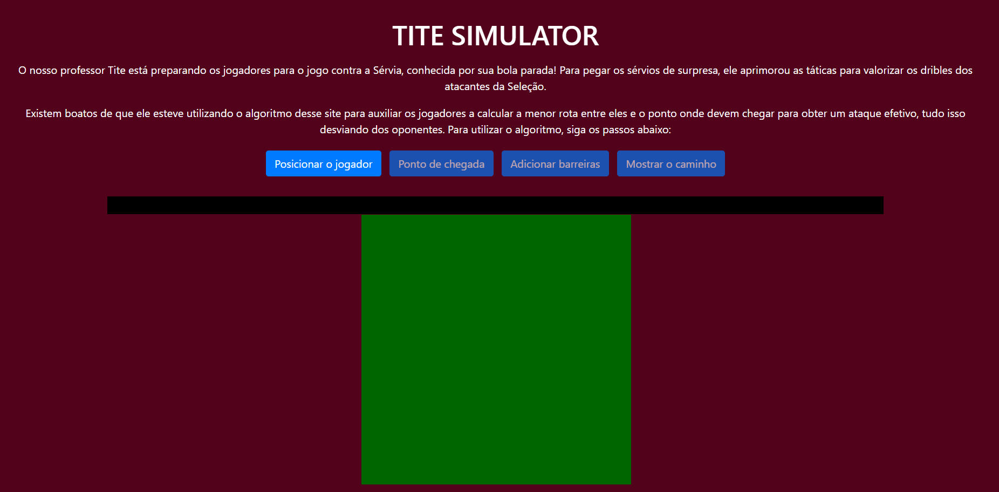
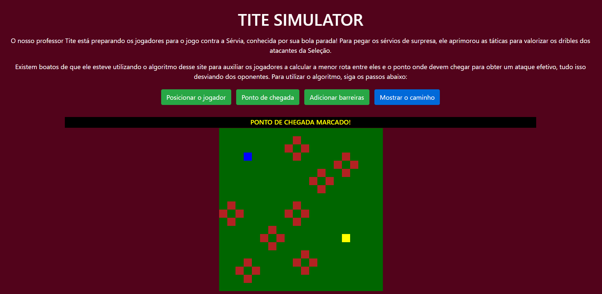

# Grafos1_TiteSimulator

**Número da Lista**: 16 
**Conteúdo da Disciplina**: Grafos 1 

## Alunos
| Matrícula | Aluno                                                       |
| --------- | ----------------------------------------------------------- |
| 180063162 | [Daniel Primo](https://github.com/danieldagerom)        |
| 150011903 | [Igor Aragão](https://github.com/roginaldosemog)            |

## Sobre
O nosso professor Tite está preparando os jogadores para o jogo contra a Sérvia, conhecida por sua bola parada! Para pegar os sérvios de surpresa, ele aprimorou as táticas para valorizar os dribles dos atacantes da Seleção.

Existem boatos de que ele esteve utilizando o algoritmo desse site para auxiliar os jogadores a calcular a menor rota entre eles e o ponto onde devem chegar para obter um ataque efetivo, tudo isso desviando dos oponentes.

O objetivo é chegar de um ponto ao outro do campo, passando pelas barreiras com o auxílio do algoritmo DFS e treinando da melhor forma para vencer a Sérvia!

## Screenshots

  

  

  

**Linguagem**: Javascript  

## Apresentação
O vídeo para apresentação se encontra disponível para baixar [AQUI](https://drive.google.com/file/d/1enBjE7iqKg-tahRYLXqJ7FrtqUC17NT4/view?usp=sharing)

## Uso
Abrir o index.html no seu navegador favorito.  
Também está disponível em https://titesimulator.netlify.app/

